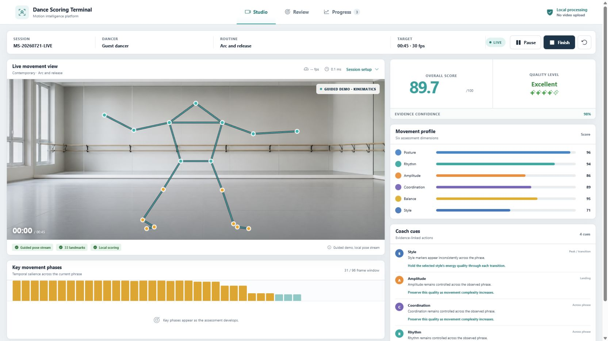
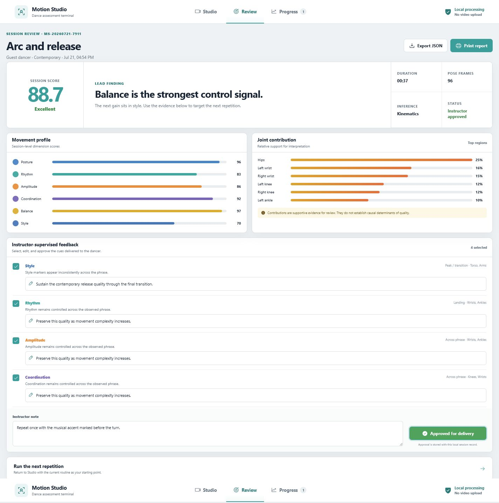
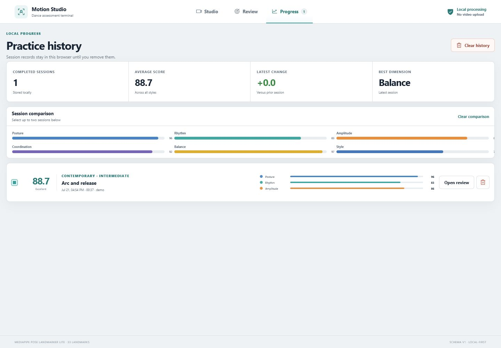

# C-TransDance

Source code for a browser-based dance scoring terminal prototype. It captures a 33-landmark pose from a bundled dancer video, an uploaded video, or a camera; displays six movement dimensions and evidence-linked feedback; and lets an instructor review, edit, and export a session. Video processing and session storage happen in the browser.



The screenshot shows a demonstration session. Its visible score comes from the prototype's local pose-kinematics engine. It is not a result from the manuscript's trained CNN–Transformer model.

## Run locally

Install [Node.js](https://nodejs.org/) and [pnpm](https://pnpm.io/installation), then run:

```bash
git clone https://github.com/Ap1rate/C-TransDance.git
cd C-TransDance
pnpm install --frozen-lockfile
pnpm dev --host 127.0.0.1 --port 4173
```

Open [http://127.0.0.1:4173/](http://127.0.0.1:4173/) to configure a session. To start the bundled nine-second dancer demonstration automatically, open [http://127.0.0.1:4173/?run=1](http://127.0.0.1:4173/?run=1). The terminal loads the bundled video and pose model, analyzes the movement, and opens Review when the video ends. Keep the development server running while using the page.

The camera option requires browser permission. The bundled video and pose model are served by the local development server, so the demonstration needs no separate model download.

## Interface workflow

1. In **Studio**, choose Contemporary, Folk, Street, or Classical dance and select the bundled demonstration, a camera, or a local video.
2. During capture, inspect the pose overlay, landmark coverage, overall score, six sub-scores, temporal salience, and feedback cues.
3. In **Review**, inspect joint contributions, edit instructor feedback, add a note, print the report, or export the session as JSON.
4. In **Progress**, reopen saved sessions and compare results. Sessions remain in the browser's local storage.





## Repository contents and branch

The release is on the [`main` branch](https://github.com/Ap1rate/C-TransDance/tree/main). It contains:

| Path | Contents |
| --- | --- |
| `src/App.tsx` | Studio, Review, and Progress interfaces |
| `src/domain/` | Pose types, deterministic kinematic scoring, timing, and tests |
| `src/services/` | Browser pose inference, model-output adapter, and local persistence |
| `src/components/` | Pose overlay component |
| `public/mediapipe/` | Bundled Pose Landmarker Lite model and WebAssembly runtime |
| `public/samples/` | Bundled single-dancer demonstration video |
| `test-data/` | Video test fixtures and source/license attribution |
| `visualization/` | Figure 6 top-joint contribution plotting script |
| `qa-*.png`, `design-qa.md` | Interface screenshots and visual review notes |

The Figure 6 script plots the joint-contribution values reported in the manuscript. Run:

```bash
python -m pip install matplotlib
python visualization/generate_fig6_top_contributions.py
```

It writes PNG and SVG files to `visualization/output/`.

## Relationship to the manuscript

This repository releases the scoring-terminal interface prototype and the Figure 6 plotting utility. The built-in scoring engine uses deterministic pose measurements for demonstration and interface testing. `src/services/modelAdapter.ts` defines an input contract for validated model predictions. The manuscript's trained CNN–Transformer weights, training pipeline, participant videos, and held-out evaluation data are outside this release. Demo scores and README screenshots do not substantiate the paper's reported accuracy, ablation, or latency results.

Source and license details for the sample video and test fixtures are in [`test-data/SOURCES.md`](test-data/SOURCES.md).

## Check the code

```bash
pnpm lint
pnpm test
pnpm build
```

The interface was verified from a fresh clone with Node.js 24.19.0 and pnpm 11.19.0. The `?run=1` route completed the nine-second pose analysis and opened Review.

