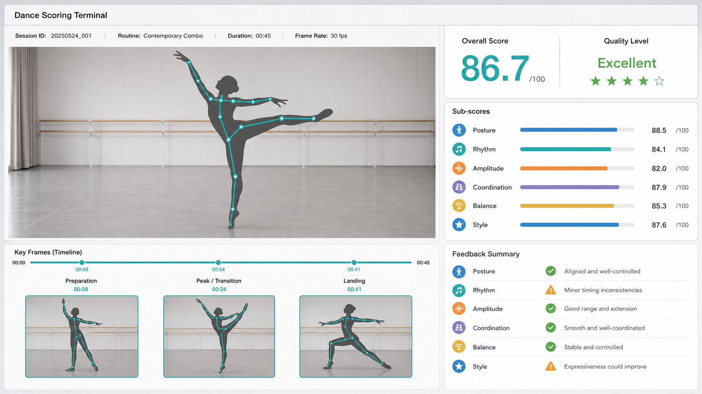
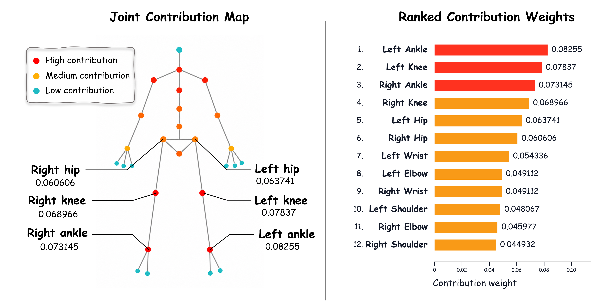

# C-TransDance

Companion code and selected final manuscript visuals for a multi-style dance-scoring terminal. The [`main` branch](https://github.com/Ap1rate/C-TransDance/tree/main) has two interface implementations: a browser-based pose-analysis application at the repository root and the lightweight interface scaffold supplied with the manuscript in [`manuscript/interface-prototype/`](manuscript/interface-prototype/). Their screens serve different purposes and are labeled separately below.

## Final manuscript interface figure



**Figure 4 in the SCI submission manuscript.** This is the final interface illustration embedded in `Dance_Scoring_Manuscript_SCI_Submission.docx`. The visible scores are illustration placeholders. The figure was not exported from the runnable React application below. The original lightweight interface scaffold supplied with the manuscript is preserved in [`manuscript/interface-prototype/`](manuscript/interface-prototype/), with its own README and MIT license.

## Runnable terminal application

The root application is a React, TypeScript, and Vite implementation of the same assessment workflow. It captures a 33-landmark pose from a bundled dancer video, an uploaded video, or a camera; displays six movement dimensions and evidence-linked feedback; and lets an instructor review, edit, and export a session. Video processing and session storage happen in the browser.


**Runnable application screenshot.** This is a July interface QA capture, distinct from manuscript Figure 4. Its score comes from the local deterministic pose-kinematics engine and is not an output of the manuscript's trained CNN–Transformer model.

### Run the application

Install [Node.js](https://nodejs.org/) and [pnpm](https://pnpm.io/installation), then run:

```bash
git clone https://github.com/Ap1rate/C-TransDance.git
cd C-TransDance
pnpm install --frozen-lockfile
pnpm dev --host 127.0.0.1 --port 4173
```

Open [http://127.0.0.1:4173/](http://127.0.0.1:4173/) to configure a session. Open [http://127.0.0.1:4173/?run=1](http://127.0.0.1:4173/?run=1) to start the bundled nine-second dancer demonstration automatically. The terminal loads the bundled video and pose model, analyzes the movement, and opens Review when the video ends. Keep the development server running while using the page. Camera input requires browser permission.

The application supports Studio capture, Review with editable instructor feedback and JSON export, and Progress with locally stored sessions. Additional application screenshots are available for [Review](qa-review-1440.png) and [Progress](qa-progress-viewport-1440.png).

Run the checks with `pnpm lint`, `pnpm test`, and `pnpm build`. The application was verified from a fresh clone with Node.js 24.19.0 and pnpm 11.19.0; the auto-run route completed pose analysis and opened Review.

## Manuscript Figure 6 and visualization code



**Figure 6 in the SCI submission manuscript.** The figure has a 33-landmark contribution map and a ranked-weight panel. [`visualization/generate_fig6_top_contributions.py`](visualization/generate_fig6_top_contributions.py) plots the twelve values in the ranked-weight panel. It does not regenerate the complete two-panel manuscript figure. To run the script:

```bash
python -m pip install matplotlib
python visualization/generate_fig6_top_contributions.py
```

PNG and SVG outputs are written to `visualization/output/`.

## Release contents and research boundary

| Path | Contents |
| --- | --- |
| `src/`, `public/`, `test-data/` | Runnable pose-analysis terminal, bundled inference resources and demo media, tests, and source attribution |
| `manuscript/figures/` | Final Figure 4 and Figure 6 images embedded in the SCI submission manuscript |
| `manuscript/interface-prototype/` | Original lightweight interface scaffold supplied in the submission package, with its own MIT license |
| `visualization/` | Script for the Figure 6 ranked-weight panel only |
| `qa-*.png`, `design-qa.md` | QA captures and notes for the runnable application |

See [`manuscript/README.md`](manuscript/README.md) for figure provenance and the distinction between the manuscript illustration, the original scaffold, and the runnable application. The root application's model adapter is [`src/services/modelAdapter.ts`](src/services/modelAdapter.ts). Trained CNN–Transformer weights, the training and evaluation pipeline, participant-level videos, and held-out evaluation data are outside this release. Demonstration scores, screenshots, and the Figure 6 plotting script do not reproduce the paper's model-performance or statistical results.

The bundled video and test fixtures have source and license details in [`test-data/SOURCES.md`](test-data/SOURCES.md). The MIT license inside `manuscript/interface-prototype/` applies to that scaffold; it does not establish a repository-wide license for the separate root application or manuscript figures.
